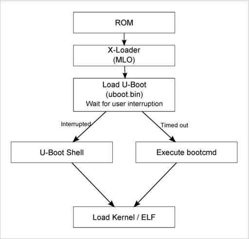

# 0. Layers of Embedded System
1. Application
2. Middle ware and user defined API
3. OS + Drivers
	* OS is used for Scheduling and timing events
	* OS based systems are for major managements(Optional)
	* Drivers contains pointers and structures
4. Physical Hardware

# Beagle Bone Black Board
* It’s an open source h/w, s/w platform
* It a single piece of circuit board, comprises most of the personal Computer hardware/software components
* Software Compatibility
    Debian
    Android
    Ubuntu
    Cloud9 IDE on Node.js w/ BoneScript library
* [Manual](BBB_Manual.pdf)
* [Schematic](BBB_Schematic.pdf)

## 1. Part details
* SOC(Systems on chips)
	* part number is U5
	* XAM3359A
* Embedded MMC (eMMC) part No: is U13.
* DDR3 part no : is U12
* UART part no: J1
	8N1 no parity and one stop bit,115200 baudrate
* Boot loader part no : s2
* Power Button part no: is s3 
* Mini port (power):part no: P6
* Memory card slot part No: P10
* MMC0 is connected to microSD card
* MMC1 is Connected to eMMC 
* DC Adapter:1A current and 5V voltage.
	
## 2. AM355x SOC by TI
* SOC is: AM3358BZCZ100 on REV ‘C’ BBB Board
* [Datasheet](AM335x_data_sheet.pdf)
* [Manual](AM335x_manual.pdf)

## 3. DDR3
* Board comes with  external Dynamic RAM memory(SDRAM) of 512MB DDR3
* During booting the boot images will get loaded to this RAM from other memories and will execute from here.

## 4. Communication Setup
Minicom is used as serial communicate program with BBB board using serial debug interface
* https://help.ubuntu.com/community/Minicom

### 1. Installations
1. Update the package index
	`sudo apt-get update`
2. Install minicom deb package 
	`sudo apt-get install minicom`

### 2. Settings
1. Connect USB to TTl 
	1. Connect the USB side of the TTL cable to your computer
	2. Connect the wires to J1 headers on your BeagleBone Black
		1. Black wire to Pin 1
		2. Green wire to Pin 4
		3. White wire to Pin 5

2. Find Port Details
	* `dmesg | grep tty`
	`[ 1977.652735] usb 1-1.4: pl2303 converter now attached to ttyUSB0`
	* `ls /dev/tty*`

3. minicom settings
	1. `sudo minicom -s`
	2. serial port setup
		A. Serial Device : /dev/ttyUSB0
		E. bps - 115200 8N1
		F- Hardware Flow Control: No
		G- Software Flow Control: No
	3. save setup as dfl
	4. exit by esc

## 5. Linux Booting

### 1. Booting Sequence
The AM335x SOC boots from the following sources
1) NAND Flash
2) NOR Flash (eXecute In place, XIP)
3) USB
4) eMMC
5) SD card
6) Ethernet(TFTT protocol)
6) UART
7) SPI
That means, you can keep the boot images in any of the above memory or peripheral and you can able to boot this SOC.

#### Boot Order
* when S2 Released (SYSBOOT[4:0] = 11100)
	MMC1 (eMMC)
	MMC0 (SD card)
	UART0
	USB0

* when S2 pressed (SYSBOOT[4:0] = 11000)
	SPI0
	MMC0 (SD card)
	USB0
	UART0

#### eMMC Boot(MMC1)
* eMMC is connected over MMC1 interface, 
* This is the fastest boot mode possible, 
* This is the default boot mode. 
* As soon as you reset the board, the board start booting from loading the images stored in the eMMC.
* If no proper boot image is found in the eMMC, then Processor will automatically try to boot from the next device on the list.

#### SD boot(MMC0)
* sd card connector at MMC0 interface
* If the default (eMMC) boot mode fails, then it will try to boot from the SD card 
* If you press S2 and then apply the power, then 
	1. the board will try to boot from the SPI
	2. if nothing is connected to SPI, it will try to boot from the MMC0(SD card)
* we can use SD card boot to flash boot images on the eMMC
	1.  boot through sd card
	2. write new images to eMMC
	3. reset the board, so that your board can boot using new images stored in the eMMC.

#### Serial Port
In this mode, the ROM code of the SOC will try to download the boot images from the serial port

#### USB Port
* This is booting through usb stick!
* You would have booted your PC through the usb stick. What you do is, you restart the PC, then press bios button to put the PC in to bios mode, there you select boot form usb, right? so It is very similar, when you reset the board, you can make your board to boot from the USB stick.

#### UART Port
* used on UART0(115200 8n1)
* Any serial communication program will work
* uses x-modem protocol to load the boot image
	1. `loadx DRAMaddress` optional only for specific address loading
	2. `(cntrl + A) + S`
	3. select `x-modem`
	4. select file by navigation
		double space to go in and single space + enter to select

### 2. Booting Stages

1. ROM bootloader(RBL)
	1. stack setup
	2. watchdog timer configuration(3minutes)
	3. system clock configuration using pll
	4. Booting
		1. checks boot devices list based on SYSBOOT reg
		2. configure booting device
		3. search & loads SPL/MLO to internal SOC Ram
		4. executes SPL/MLO from internal SOC Ram

2. Memory Loader/Secondary program loader(MLO/SPL) Job
	rbl + mlo(bootloader - process of loading boot files)
	This is also known as X-loader
	1. UART Initialization for printing debug messages
	2. ppl modification to desired value
	3. Configures communication between the SOC and DRAM
	4. search and Load u-boot.img to DRAM
	5. runs u-boot.img

3. u-boot jobs
	booting - process of loading kernel to main memory
	1. initialize peripherals 
	2. loads Linux kernel Image(ROOTFS/boot/uBoot) to DRAM
	3. Passing boot arguments

### 3. Booting Setup

#### SD Card

**Auto Booting**
1. Make SD Card Bootable
	1. Install Gparted
		1. Update the package index
			`sudo apt-get update`
			`sudo apt-get upgrade`
		2. Install software to make pendrive bootable 
			`sudo apt-get install gparted`
	2. Format SD Card
	3. Create New partition for boot files
		- Label: BOOT
		- file system: fat16 (minimum 2gb)
	4. Create New Partition for linux root files
		- Label: ROOTFS
		- file system: ext3/ext4 
	5. Apply all operations
	6. set boot flag for BOOT partition
2. copy Image files to BOOT partition
	1. MLO
	2. u-boot.img
	3. uEnv.txr
3. Copy ROOT files to ROOTFS partition
	1. open ROOT files directory in terminal
	2. `sudo cp -r * /media/user/ROOTFS`
4. Insert SD card to BBB board and 
5. connect serial ttl cable to pc and open terminal -> run minicom
6. boot the board from SD card using S2 switch

**Manual Booting**
0. Boot from SD Card and Enter manual booting
1. Write uEnv.txt file 
	console=ttyO0,115200n8
	ipaddr=192.168.7.2
	serverip=192.168.7.1
	loadaddr=0x82000000
	fdtaddr=0x88000000
	1. Write Commands
		1. Load uImage file
			loadfromsd=load mmc 0:2 ${loadaddr}  /boot/uImage
		2. Load .dtb file
			load mmc 0:2 ${fdtaddr} /boot/am335x-boneblack.dtb
		3.  get Logs
			linuxbootargs=setenv bootargs console=${console} root=/dev/mmcblk0p2 rw
	2. Run Commands
		uenvcmd=setenv autoload no; 
		run loadfromsd;
		run linuxbootargs; 
		bootm ${loadaddr} - ${fdtaddr}
2.	Load uEnv file
	`loady` 
3. Import env variable
	`env import -t loaded location`
	other Cmds
	`printenv`
	`iminfo`
	`help`
4. Boot to kernel 
	`run bootcmd` or `boot`

#### UART Port
1. enter into uart boot mode
	1. connect serial ttl cable
	2. press s2 and power by dc adapter
2. Load TI Images to DRAM 
	1. open terminal and run `sudo minicom` 
		Response: `CCCCCCCCCCC`
	2. load MLO(u-boot-spl.bin) using x-modem `(cntrl+a)+s`
	3. load u-boot.img using x-modem
	4. enter space to enter into U-boot area
	5. load uImage at 0x82000000  `loadx 0x82000000`
	6. load .dtb file art 0x88000000 `loadx 0x88000000`
	7. load intra file system at 0x88080000`loadx 0x88080000` 
3. set bootargs(for logs)
	`setenv bootargs console=ttyO0,115200 root=/dev/ram0 rw initrd=0x8808000`
4. boot with memory address
	`bootm ${kernelImage_addr} ${inrafrms_addr} ${dtb_addr}`
	`bootm 0x82000000 0x88080000 0x88000000`

## Linux Building

### 1. Cross Compiler(Linux Host)
1. Download arm cross toolchain for your Host machine
[gcc-linaro-5.5.0-2017.10-x86_64_arm-linux-gnueabihf.tar.xz](https://releases.linaro.org/components/toolchain/binaries/latest-5/latest-5/arm-linux-gnueabihf/)
2. Install Development Tools
	* `sudo apt install build-essential`
	* `sudo apt install bison`
	* `sudo apt install flex`
	* `sudo apt-get install libncurses5-dev libncursesw5-dev`
	* `sudo apt-get install -y u-boot-tools`
	* `sudo apt install lzop	`
3. settings
	export  path of the cross compilation toolchain
	1. open bashrc `code ~/.bashrc` 
	2. update path in .bashrc file 
		`export PATH=/home/user/Documents/gcc-linaro-5.5.0-2017.10-x86_64_arm-linux-gnueabihf/bin:$PATH`
		 or 
		`export PATH=$PATH:/home/user/Documents/gcc-linaro-5.5.0-2017.10-x86_64_arm-linux-gnueabihf/bin`
	3. reload bashrc `source /home/user/.bashrc`
	4. `arm` and couples of times TAB button to see the files

### 2. Uboot Compilation
Building bootloader u-boot.img and u-boot-spl.bin(MLO)
0. Download u-boot [u-boot.img raw c files](ftp://ftp.denx.de/pub/u-boot/)
1. Clean old object files
	`make ARCH=arm CROSS_COMPILE=arm-linux-gnueabihf- distclean`
2. Generate Default Configurations
	`make ARCH=arm CROSS_COMPILE=arm-linux-gnueabihf- am335x_boneblack_defconfig`
3. run menuconfig, if you want to do any settings other than default configuration . 
	`make ARCH=arm CROSS_COMPILE=arm-linux-gnueabihf-  menuconfig`
4. To generate bootloader
	`make ARCH=arm CROSS_COMPILE=arm-linux-gnueabihf- -j4`
	To Cores `nproc`(4 core machine) 

### 3. Linux Compilation
1. Download Linux kernel [Beagle board Linux kernel](https://github.com/beagleboard/linux)
2. Clean the Directory
	`make ARCH=arm CROSS_COMPILE=arm-linux-gnueabihf- distclean`
3. set defualt configurations
	` make ARCH=arm CROSS_COMPILE=arm-linux-gnueabihf- bb.org_defconfig`
4. Menu Configurations
	`make ARCH=arm CROSS_COMPILE=arm-linux-gnueabihf- menuconfig`
5. Generate Uboot Image and set dtb file address
	make ARCH=arm CROSS_COMPILE=arm-linux-gnueabihf- uImage dtbs LOADADDR=0x80008000 -j4
6. Generate Modules
	make ARCH=arm CROSS_COMPILE=arm-linux-gnueabihf- -j4 modules
7. Generate RFS_Static using Busy box Compilation [link](###%20Busy%20box%20compilation)
8. Generate library files
	`make ARCH=arm CROSS_COMPILE=arm-linux-gnueabihf- INSTALL_MOD_PATH=/home/user/softwares/RFS_Static modules_install`

### 4. Busy box compilation
**Features**
* This is used to generate one executable file for which all other files report
* This is used to generate the minimal rootfs with kernel files ie RFS_Static
* Compilation utility by menu gui
	* kernel optimization
	* kernel with static or dynamic libraries 
**Steps**
1. Install Busybox [link](https://www.busybox.net/downloads/busybox-1.26.0.tar.bz2)
2. Open terminal in the busy box directory
3. Clean old files
	`make ARCH=arm CROSS_COMPILE=arm-linux-gnueabihf- distclean`
4. generate the default configuration file
	`make ARCH=arm CROSS_COMPILE=arm-linux-gnueabihf- defconfig`
5. Change menu settings
	1. `make ARCH=arm CROSS_COMPILE=arm-linux-gnueabihf- menuconfig`
	2. change busybox settings->static library select and save
6. generate the ROOT File system 
	`make ARCH=arm CROSS_COMPILE=arm-linux-gnueabihf- CONFIG_PREFIX=/home/user/softwares/RFS_Static install -j`4
7. Check the files generated in the path

## Peripheral Interface
* Onboard peripherals are handled device drivers
* pin address is offset + base address
* To pin details
	`root@beaglebone:/sys/kernel/debug/pinctrl/44e10800.pinmux-pinctrl-single`
* Led Handling
	`sudo su`
	`root@beaglebone:/sys/class/leds/beaglebone:green:usr3# echo "heartbeat" > trigger`
	`root@beaglebone:/sys/class/leds/beaglebone:green:usr3# echo "none" > trigger`

## Reference links
* [Logs guide](https://johnvidler.co.uk/linux-journal/LJ/234/11551.html)
* [OEMU linux kernel](https://learningfromyoublog.wordpress.com/)